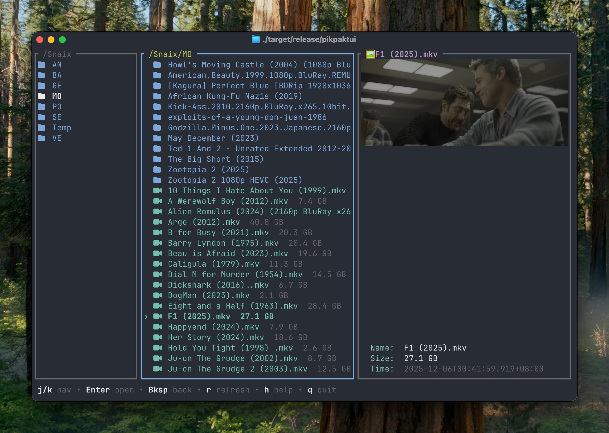
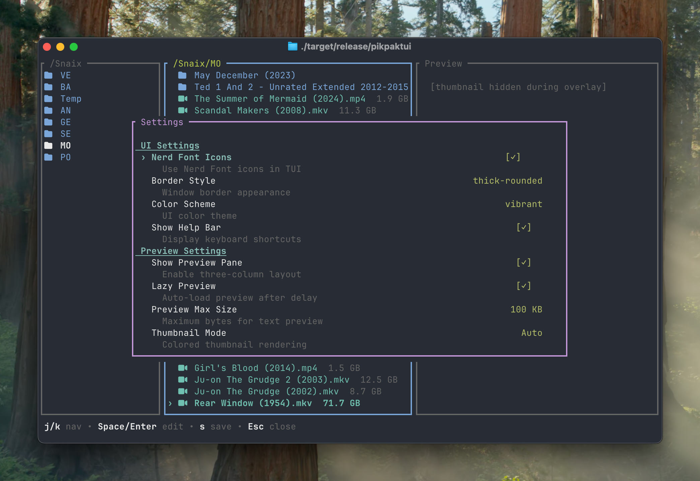

# pikpaktui

A TUI and CLI client for [PikPak](https://mypikpak.com) cloud storage, written in pure Rust with no external runtime dependencies.

| main | setting |
| --- | --- |
|  |  |

## Features

### Interactive TUI
- **Three-column Miller layout** — Parent / current / preview panes (Yazi-style), with optional two-column mode
- **Thumbnail preview** — Media files display thumbnail images directly in the terminal via native image protocols (Kitty, iTerm2, Sixel) using [ratatui-image](https://github.com/benjajaja/ratatui-image). Fallback modes: colored half-block rendering and grayscale ASCII art. Per-terminal protocol auto-detection with manual override
- **Text preview** — Syntax-highlighted code/text preview powered by [syntect](https://github.com/trishume/syntect) (base16-ocean.dark theme), supporting 50+ languages with line numbers
- **Folder preview** — Instant children listing in the preview pane; cached entries are reused when opening folders (zero extra API calls)
- **File operations** — Move, copy, rename, delete (trash or permanent), create folder, star/unstar
- **Folder picker** — Visual two-pane picker for move/copy destinations, with tab-completion text input as alternative
- **Cart & batch download** — Add files to cart, batch download with pause/resume/cancel, HTTP Range resume for interrupted transfers, download state persisted across sessions
- **Download dashboard** — Collapsed popup or expanded full-screen view with braille-character network activity graph, per-file progress, speed, ETA
- **Offline download** — Submit URLs/magnets for PikPak cloud download, view and manage tasks
- **Interactive settings** — In-app settings editor (`,`), custom RGB colors per file category, per-terminal image protocol configuration
- **Mouse support** — Click to select, double-click to open, scroll wheel navigation

### CLI
- **20 subcommands** — `ls`, `mv`, `cp`, `rename`, `rm`, `mkdir`, `download`, `upload`, `share`, `offline`, `tasks`, `star`, `unstar`, `starred`, `events`, `quota`, `vip`, `completions`, `help`, `version`
- **Colored output** — `ls` with multi-column grid layout (eza-style), Nerd Font icons support
- **Resumable transfer** — Upload: dedup-aware instant upload on hash match, multipart resumable with 10 MB chunks via OSS. Download: HTTP Range resume for interrupted transfers
- **Shell completions** — Zsh completion with dynamic cloud path completion (like `scp`)

### General
- **Pure Rust** — Built with `ratatui` + `crossterm` + `reqwest` (rustls-tls), no OpenSSL or C dependencies
- **Persistent sessions** — Login once, session auto-refreshes via token refresh
- **Cross-platform** — Linux (x86_64 musl static), macOS Intel, macOS Apple Silicon

## Install

### Homebrew (macOS / Linux)

```bash
brew install Bengerthelorf/tap/pikpaktui
```

### Cargo

```bash
cargo install pikpaktui
```

### From source

```bash
git clone https://github.com/Bengerthelorf/pikpaktui.git
cd pikpaktui
cargo build --release
./target/release/pikpaktui
```

### GitHub Releases

Pre-built binaries for Linux (x86_64, static musl), macOS Intel, and macOS Apple Silicon are available on the [Releases](https://github.com/Bengerthelorf/pikpaktui/releases) page.

## Shell Completions

### Zsh

Supports dynamic cloud path completion — press `Tab` to list remote files/folders, like `scp`. Works with [fzf-tab](https://github.com/Aloxaf/fzf-tab).

```bash
# Option 1: Add to .zshrc
eval "$(pikpaktui completions zsh)"

# Option 2: Save to fpath
pikpaktui completions zsh > ~/.zfunc/_pikpaktui
# Then in .zshrc: fpath=(~/.zfunc $fpath); autoload -Uz compinit; compinit

# Option 3: Oh My Zsh
pikpaktui completions zsh > ${ZSH_CUSTOM:-~/.oh-my-zsh/custom}/completions/_pikpaktui
```

What gets completed:

| Context | Completion |
|---------|------------|
| `pikpaktui <Tab>` | Subcommands with descriptions |
| `pikpaktui ls /<Tab>` | Remote directory listing |
| `pikpaktui ls -<Tab>` | `-l`, `--long` |
| `pikpaktui mv /src<Tab> /dst<Tab>` | Cloud paths for both arguments |
| `pikpaktui download /cloud<Tab> ./<Tab>` | Cloud path, then local path |
| `pikpaktui upload ./<Tab> /<Tab>` | Local path, then cloud path |
| `pikpaktui tasks <Tab>` | `list`, `retry`, `delete` subcommands |
| `pikpaktui rm -<Tab>` | `-f` flag |

## Usage

### TUI mode

Run without arguments to launch the interactive file browser:

```bash
pikpaktui
```

If no valid session exists, a login form will appear. After login, credentials are saved to `~/.config/pikpaktui/login.yaml` and the session is persisted to `~/.config/pikpaktui/session.json`.

Press `,` to open the settings editor. Press `h` for the help sheet.

### CLI mode

```bash
# File management
pikpaktui ls /                                        # Colored multi-column grid
pikpaktui ls -l "/My Pack"                            # Long format (id + size + date + name)
pikpaktui mv "/My Pack/file.txt" /Archive             # Move file
pikpaktui cp "/My Pack/file.txt" /Backup              # Copy file
pikpaktui rename "/My Pack/old.txt" new.txt           # Rename
pikpaktui rm "/My Pack/file.txt"                      # Delete (to trash)
pikpaktui rm -f "/My Pack/file.txt"                   # Delete permanently
pikpaktui mkdir "/My Pack" newfolder                  # Create folder

# Transfer
pikpaktui download "/My Pack/file.txt"                # Download to current dir
pikpaktui download "/My Pack/file.txt" /tmp/file.txt  # Download to specific path
pikpaktui upload ./local-file.txt "/My Pack"          # Upload (dedup + resumable)
pikpaktui share "/My Pack/file.txt"                   # Print PikPak share links
pikpaktui share "/My Pack" -o links.txt               # Save folder share links to file

# Offline / cloud download
pikpaktui offline "magnet:?xt=..."                    # Submit magnet link
pikpaktui offline "https://example.com/file.zip" --to "/Downloads" --name "file.zip"
pikpaktui tasks                                       # List offline tasks
pikpaktui tasks retry <task_id>                       # Retry failed task
pikpaktui tasks rm <task_id>                          # Delete task

# Star & activity
pikpaktui star "/My Pack/file.txt"                    # Star a file
pikpaktui unstar "/My Pack/file.txt"                  # Unstar
pikpaktui starred                                     # List starred files
pikpaktui events                                      # Recent file events

# Account
pikpaktui quota                                       # Storage quota
pikpaktui vip                                         # VIP status, invite code, transfer quota
```

CLI mode requires login: it checks for a valid session first, then falls back to `login.yaml` credentials. If neither exists, run `pikpaktui` (TUI) to login.

## TUI Keybindings

### File Browser

| Key | Action |
|-----|--------|
| `j` / `k` / `↑` / `↓` | Navigate |
| `Enter` | Open folder |
| `Backspace` | Go back to parent |
| `r` | Refresh |
| `m` | Move |
| `c` | Copy |
| `n` | Rename |
| `d` | Delete (trash / permanent) |
| `f` | New folder |
| `s` | Star / unstar |
| `a` | Toggle in cart |
| `A` | View cart |
| `D` | Downloads view |
| `o` | Offline download (URL/magnet) |
| `O` | Offline tasks |
| `Space` | Preview / file info |
| `p` | Text content preview |
| `l` | Toggle log overlay |
| `,` | Settings |
| `h` | Help sheet |
| `q` | Quit |

### Folder Picker (Move / Copy)

| Key | Action |
|-----|--------|
| `j` / `k` | Navigate |
| `Enter` | Open folder |
| `Backspace` | Go back |
| `Space` | Confirm destination |
| `/` | Switch to text input |
| `Esc` | Cancel |

### Text Input (Move / Copy)

| Key | Action |
|-----|--------|
| `Tab` | Autocomplete cloud path |
| `Enter` | Select candidate / confirm |
| `Ctrl+B` | Switch to picker |
| `Esc` | Close candidates / cancel |

### Cart View

| Key | Action |
|-----|--------|
| `j` / `k` | Navigate |
| `x` / `d` | Remove from cart |
| `a` | Clear all |
| `Enter` | Download all |
| `Esc` | Close |

### Download View

| Key | Action |
|-----|--------|
| `j` / `k` | Navigate tasks |
| `Enter` | Toggle collapsed / expanded view |
| `p` | Pause / resume |
| `x` | Cancel task |
| `r` | Retry failed task |
| `Esc` | Close (or collapse) |

### Settings

| Key | Action |
|-----|--------|
| `j` / `k` | Navigate items |
| `Space` / `Enter` | Edit setting |
| `Left` / `Right` | Cycle value |
| `s` | Save to `config.toml` |
| `Esc` | Discard and close |

### Mouse

- **Click** — Select entry in parent or current pane
- **Double-click** — Open folder
- **Scroll wheel** — Navigate entries or scroll preview

## Configuration

All configuration files live under `~/.config/pikpaktui/`.

### Credentials — `login.yaml`

```yaml
username: "you@example.com"
password: "your-password"
```

### TUI Settings — `config.toml`

```toml
[tui]
nerd_font = false         # Nerd Font icons in TUI
cli_nerd_font = false     # Nerd Font icons in CLI output
move_mode = "picker"      # "picker" (two-pane) or "input" (text input)
show_help_bar = true      # Bottom help bar
border_style = "thick"    # "rounded" | "thick" | "thick-rounded" | "double"
color_scheme = "vibrant"  # "vibrant" | "classic" | "custom"
show_preview = true       # Three-column layout (false = two-column)
lazy_preview = false      # Auto-load preview on cursor move
preview_max_size = 65536  # Max bytes for text preview (default 64 KB)
thumbnail_mode = "auto"   # "auto" | "off" | "force-color" | "force-grayscale"

# Per-terminal image protocol configuration
# Detected via $TERM_PROGRAM environment variable
[tui.image_protocols]
ghostty = "kitty"
"iTerm.app" = "iterm2"
WezTerm = "auto"          # "auto" | "kitty" | "iterm2" | "sixel"

# Custom colors (only used when color_scheme = "custom")
[tui.custom_colors]
folder = [92, 176, 255]
archive = [255, 102, 102]
image = [255, 102, 255]
video = [102, 255, 255]
audio = [0, 255, 255]
document = [102, 255, 102]
code = [255, 255, 102]
default = [255, 255, 255]
```

### Session — `session.json`

Auto-managed. Stores access/refresh tokens. No manual editing needed.

### Download State — `downloads.json`

Auto-managed. Persists incomplete download tasks (pending / paused / failed) across sessions.

## Environment Variables

| Variable | Description |
|----------|-------------|
| `PIKPAK_DRIVE_BASE_URL` | Override PikPak drive API endpoint |
| `PIKPAK_AUTH_BASE_URL` | Override PikPak auth API endpoint |
| `PIKPAK_CLIENT_ID` | Override OAuth client ID |
| `PIKPAK_CLIENT_SECRET` | Override OAuth client secret |
| `PIKPAK_CAPTCHA_TOKEN` | Provide CAPTCHA token for login |

## Project Structure

```
src/
  main.rs                Entry point, CLI dispatch or TUI launch
  config.rs              Credentials (login.yaml), TUI settings (config.toml)
  pikpak.rs              PikPak REST API client (auth, drive ops, upload, offline, VIP)
  theme.rs               File categorization, icons, color schemes
  cmd/
    mod.rs               Shared CLI helpers (client init, path resolution)
    help.rs              Colored ASCII-art help banner
    ls.rs                ls — colored grid / long format
    mv.rs                mv — move files
    cp.rs                cp — copy files
    rename.rs            rename — rename files
    rm.rs                rm — trash / permanent delete
    mkdir.rs             mkdir — create folder
    download.rs          download — download to local
    upload.rs            upload — resumable dedup-aware upload
    share.rs             share — generate PikPak:// share links
    quota.rs             quota — storage usage
    offline.rs           offline — submit URL/magnet download
    tasks.rs             tasks — manage offline tasks
    star.rs              star — star files
    unstar.rs            unstar — unstar files
    starred.rs           starred — list starred files
    events.rs            events — recent activity
    vip.rs               vip — VIP status and invite code
    completions.rs       completions — shell completion script generator
    complete_path.rs     __complete_path — internal dynamic path completion helper
  tui/
    mod.rs               App state, event loop, Miller columns, syntax highlighting
    draw.rs              All rendering (login, 3-column layout, overlays, settings)
    handler.rs           Keyboard and mouse input handling
    completion.rs        Remote cloud path tab-completion (for move/copy input)
    local_completion.rs  Local filesystem path tab-completion (for download destination)
    download.rs          Download manager (task queue, workers, pause/resume, persistence)
    download_view.rs     Download UI (collapsed popup / expanded full-screen with network graph)
```

## License

[Apache-2.0](LICENSE)
