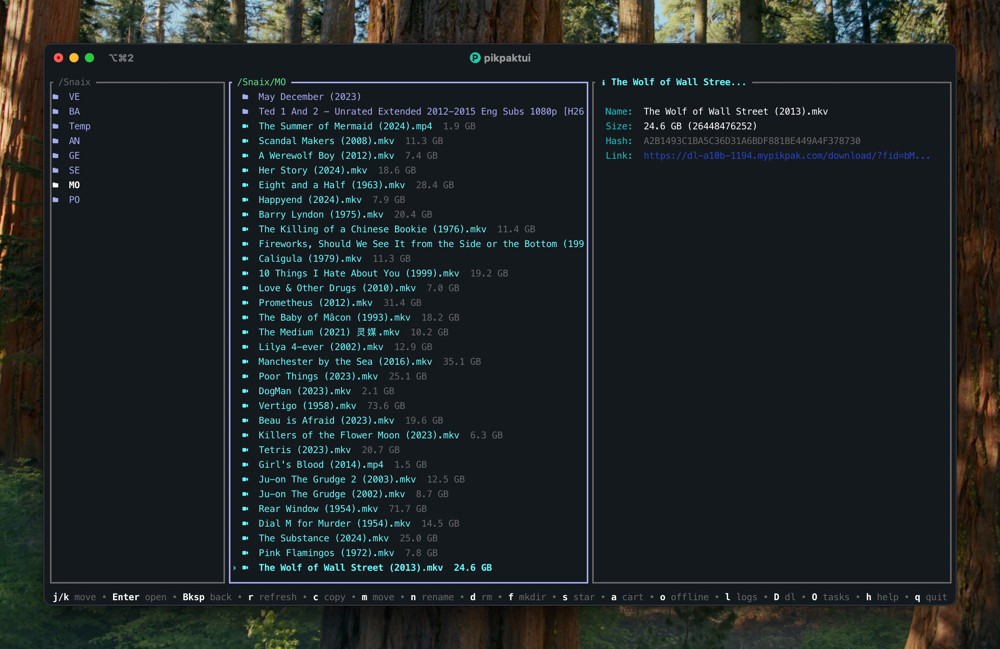

# pikpaktui

A TUI and CLI client for [PikPak](https://mypikpak.com) cloud storage, written in pure Rust with no external runtime dependencies.



## Features

- **Three-column Miller layout** - Yazi-style parent / current / preview panes, with optional two-column mode (`show_preview = false`)
- **Preview pane** - Folder children listing, file basic info, or detailed info (size, hash, link); lazy auto-load or manual with `Space`
- **CLI subcommands** - `ls` / `mv` / `cp` / `rename` / `rm` / `mkdir` / `download` / `upload` / `share` / `quota` / `offline` / `tasks` / `star` / `unstar` / `starred` / `vip` / `events`
- **File operations** - Move, copy, rename, delete (trash / permanent), create folder
- **Folder picker** - Visual two-pane picker for move/copy destinations, with tab-completion text input as alternative
- **Cart & batch download** - Add files to cart, batch download with progress bars, pause/resume
- **Offline download** - Submit URLs/magnets for cloud download, view and manage offline tasks
- **Star** - Star/unstar files with persistent ★ indicator, check VIP status
- **Log overlay** - Toggle floating log panel with `l`
- **Quota query** - Check storage usage
- **Login** - TUI login form with auto-saved credentials and persistent sessions
- **Pure Rust** - Built with `ratatui` + `crossterm` + `reqwest` (rustls), no OpenSSL or C dependencies

## Install

### Homebrew (macOS / Linux)

```bash
brew install Bengerthelorf/tap/pikpaktui
```

### Cargo

```bash
cargo install pikpaktui
```

### From source

```bash
git clone https://github.com/Bengerthelorf/pikpaktui.git
cd pikpaktui
cargo build --release
./target/release/pikpaktui
```

### GitHub Releases

Pre-built binaries for Linux (x86_64, static musl), macOS Intel, and macOS Apple Silicon are available on the [Releases](https://github.com/Bengerthelorf/pikpaktui/releases) page.

## Usage

### TUI mode

Run without arguments to launch the interactive file browser:

```bash
pikpaktui
```

If no valid session exists, a login form will appear. After login, credentials are saved to `login.yaml` and the session is persisted to `session.json`.

### CLI mode

```bash
pikpaktui ls /                                        # List files in colored multi-column grid
pikpaktui ls -l "/My Pack"                            # Long format (id + size + date + name)
pikpaktui mv "/My Pack/file.txt" /Archive             # Move file
pikpaktui cp "/My Pack/file.txt" /Backup              # Copy file
pikpaktui rename "/My Pack/old.txt" new.txt           # Rename
pikpaktui rm "/My Pack/file.txt"                      # Delete (to trash)
pikpaktui mkdir "/My Pack" newfolder                  # Create folder
pikpaktui download "/My Pack/file.txt"                # Download to current dir
pikpaktui download "/My Pack/file.txt" /tmp/file.txt  # Download to path
pikpaktui upload ./local-file.txt "/My Pack"          # Upload a file
pikpaktui share "/My Pack/file.txt"                   # Print PikPak share links
pikpaktui share "/My Pack" -o links.txt               # Save share links to file
pikpaktui offline "magnet:?xt=..."                    # Submit offline download
pikpaktui tasks                                       # List offline tasks
pikpaktui star "/My Pack/file.txt"                    # Star a file
pikpaktui unstar "/My Pack/file.txt"                  # Unstar a file
pikpaktui starred                                     # List starred files
pikpaktui vip                                         # Show VIP status
pikpaktui events                                      # List recent events
pikpaktui quota                                       # Show storage quota
```

CLI mode requires login: it checks for a valid session first, then falls back to `login.yaml` credentials. If neither exists, run `pikpaktui` (TUI) to login.

## TUI Keybindings

| Key | Action |
|-----|--------|
| `j` / `↓` | Move down |
| `k` / `↑` | Move up |
| `Enter` | Open folder |
| `Backspace` | Go back |
| `r` | Refresh |
| `c` | Copy |
| `m` | Move |
| `n` | Rename |
| `d` | Remove (trash / permanent) |
| `f` | New folder |
| `s` | Star / unstar |
| `a` | Add to cart |
| `A` | View cart |
| `D` | Downloads view |
| `o` | Offline download |
| `O` | Offline tasks |
| `Space` | Preview / file info |
| `l` | Toggle log overlay |
| `h` | Help panel |
| `q` | Quit |

### Folder Picker (Move/Copy)

| Key | Action |
|-----|--------|
| `j` / `↓` | Move down |
| `k` / `↑` | Move up |
| `Enter` | Open folder |
| `Backspace` | Go back |
| `Space` | Confirm destination |
| `/` | Switch to text input |
| `h` | Help panel |
| `Esc` | Cancel |

### Text Input (Move/Copy)

| Key | Action |
|-----|--------|
| `Tab` | Autocomplete path |
| `Enter` | Select candidate / confirm |
| `Ctrl+B` | Switch to picker |
| `Esc` | Close candidates / cancel |

## Configuration

### Credentials (`login.yaml`)

```
~/.config/pikpaktui/login.yaml
```

```yaml
username: "you@example.com"
password: "your-password"
```

### TUI settings (`config.toml`)

```
~/.config/pikpaktui/config.toml
```

```toml
nerd_font = false        # Enable Nerd Font icons (TUI)
cli_nerd_font = false    # Enable Nerd Font icons (CLI)
move_mode = "picker"     # "picker" (two-pane) or "input" (text input)
show_help_bar = true     # Show help bar at the bottom
border_style = "thick"   # "rounded" | "thick" | "double"
color_scheme = "vibrant" # "vibrant" | "classic"
show_preview = true      # Three-column layout with preview pane (false = two-column)
lazy_preview = false     # Auto-load preview on cursor move (true = auto, false = Space to load)
```

## Project Structure

```
src/
  main.rs           Entry point, TUI launcher
  config.rs         login.yaml / config.toml loading
  pikpak.rs         PikPak API client (auth, file ops, download, upload)
  theme.rs          File icons, colors, and color schemes
  cmd/
    mod.rs          Shared CLI helpers (client init, path utils)
    ls.rs           ls command
    mv.rs           mv command
    cp.rs           cp command
    rename.rs       rename command
    rm.rs           rm command
    mkdir.rs        mkdir command
    download.rs     download command
    upload.rs       upload command
    share.rs        share command
    quota.rs        quota command
    offline.rs      offline download command
    tasks.rs        offline tasks command
    star.rs         star command
    unstar.rs       unstar command
    starred.rs      starred files command
    vip.rs          VIP status command
    events.rs       events command
    help.rs         help command
  tui/
    mod.rs          App state, event loop, miller columns state
    draw.rs         Three-column layout, preview pane, overlays, themes
    handler.rs      Keyboard input handling, cached navigation
    completion.rs   Remote path tab-completion
    local_completion.rs  Local path tab-completion
    download.rs     Download manager with progress tracking
```

## License

[Apache-2.0](LICENSE)
