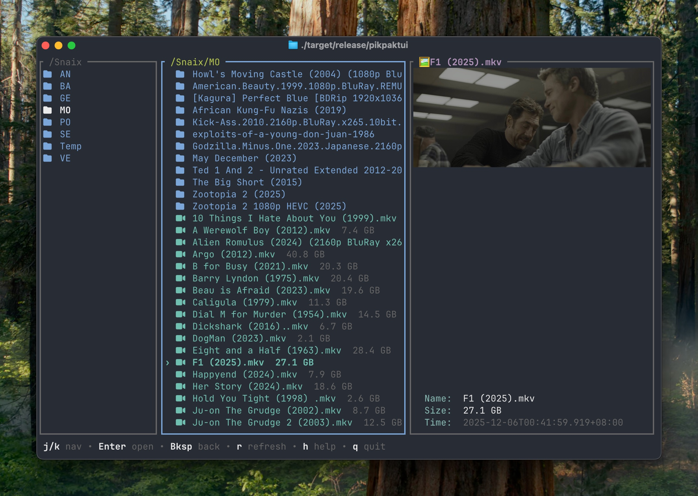
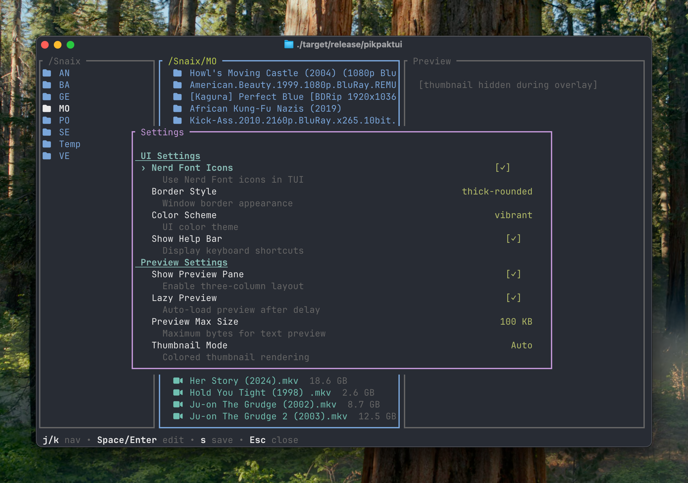
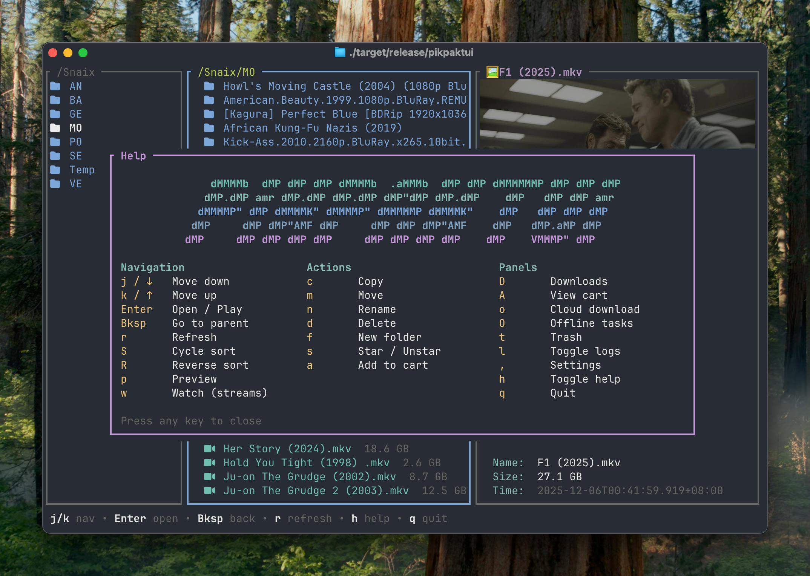
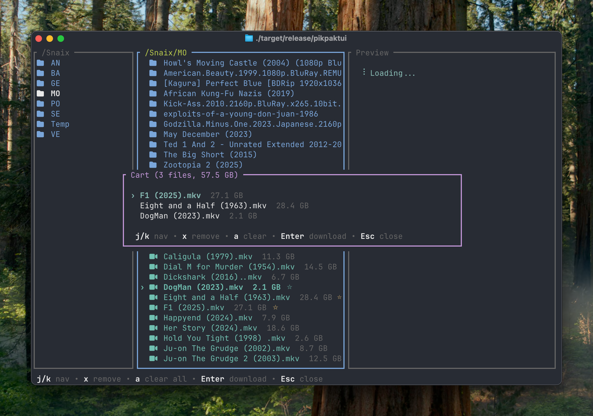
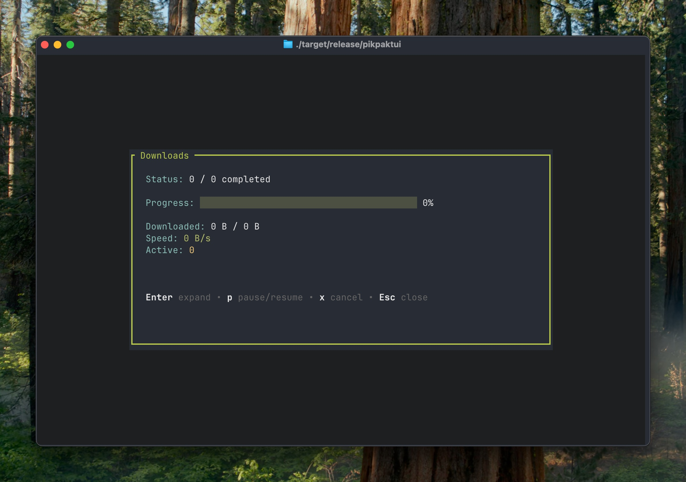
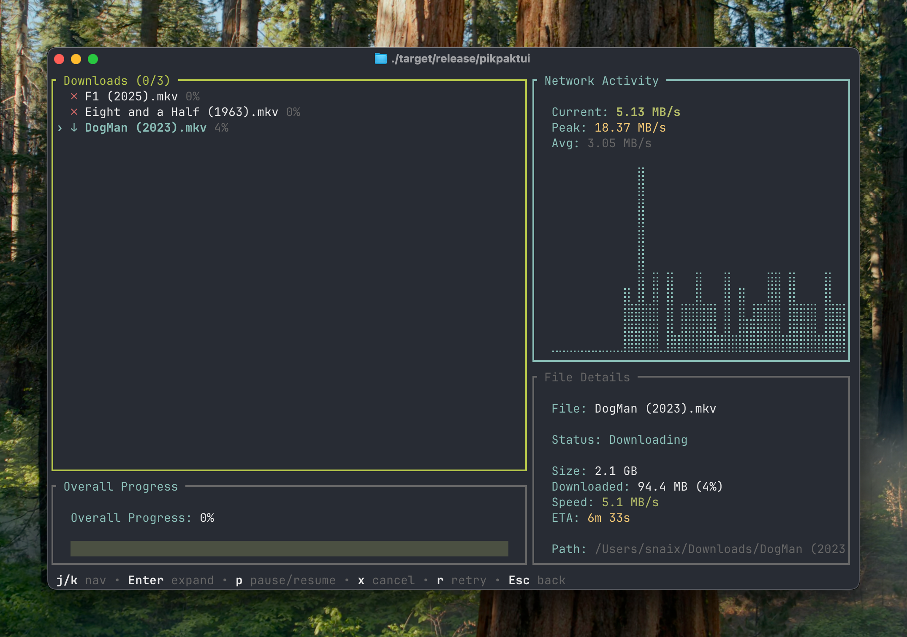
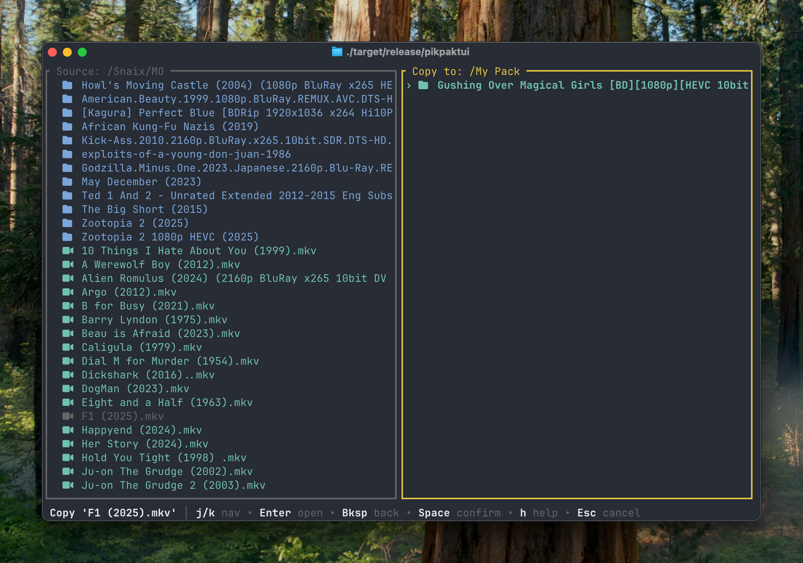
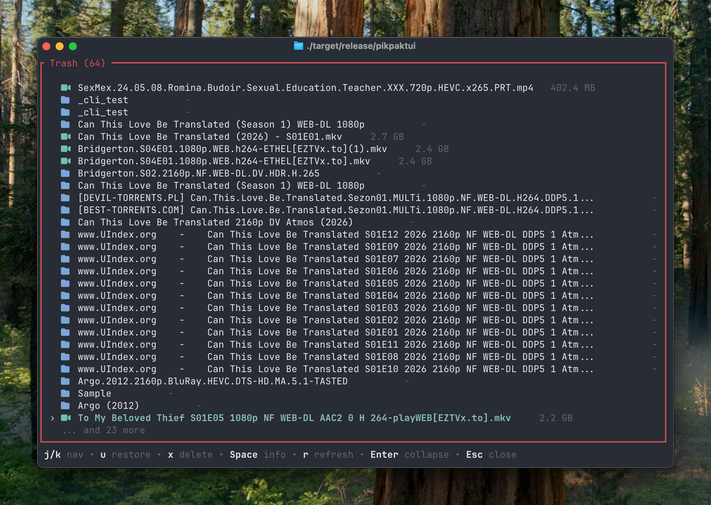
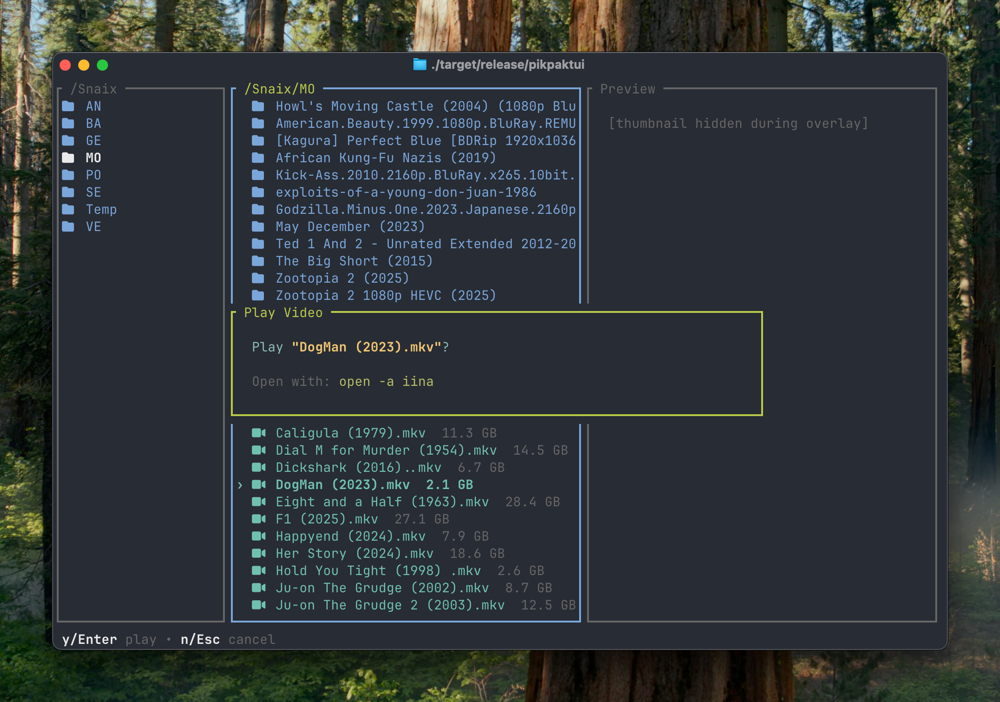

<div align="center">

# pikpaktui

**A TUI and CLI client for [PikPak](https://mypikpak.com) cloud storage — written in pure Rust.**

[](https://crates.io/crates/pikpaktui)
&nbsp;
[](https://bengerthelorf.github.io/pikpaktui/)
&nbsp;
[](https://github.com/Bengerthelorf/pikpaktui#install)

<br>

|  |  |  |
| --- | --- | --- |
|  |  |  |
|  |  |  |

<br>

### [📖 Read the Full Documentation →](https://bengerthelorf.github.io/pikpaktui/)

CLI reference, TUI guide, configuration, shell completions, and more.

</div>

---

## Highlights

- 🖥️ **Interactive TUI** — Three-column Miller layout (like Yazi) with thumbnail previews, syntax highlighting, and keyboard-driven navigation
- ⌨️ **Full CLI** — 27 subcommands (`ls`, `mv`, `cp`, `rm`, `download`, `upload`, `share`, `login`, and more) with colored output, JSON mode, and dry-run support
- 🎬 **Video Streaming** — Stream videos directly from PikPak to your local player (IINA, mpv, VLC)
- 📥 **Cloud Downloads** — Add magnet links and URLs for offline downloading
- 🔗 **Share Management** — Create, list, save, and delete share links with optional password protection
- 🐚 **Shell Completions** — Zsh completions with dynamic cloud path completion via Tab
- 🦀 **Pure Rust** — Built on `ratatui` + `crossterm` + `reqwest` (rustls-tls). No OpenSSL, no C dependencies

## Install

### Homebrew (macOS / Linux)

```bash
brew install Bengerthelorf/tap/pikpaktui
```

### Cargo

```bash
cargo install pikpaktui
```

### Pre-built Binaries

Download from [Releases](https://github.com/Bengerthelorf/pikpaktui/releases/latest) — available for Linux (x86_64 musl static), macOS Intel, and macOS Apple Silicon.

### From Source

```bash
git clone https://github.com/Bengerthelorf/pikpaktui.git
cd pikpaktui
cargo build --release
./target/release/pikpaktui
```

## Quick Start

Launch the TUI — on first run a login form will appear:

```bash
pikpaktui
```

Or log in non-interactively for scripts and automation:

```bash
pikpaktui login -u user@example.com -p yourpassword
```

Use CLI subcommands directly:

```bash
pikpaktui ls /
pikpaktui download "/My Pack/video.mp4"
pikpaktui upload ./local.txt "/My Pack"
pikpaktui share -p -d 7 /movie.mkv
```

Press `,` for settings, `h` for help, `q` to quit.

> **Need help?** Check the [Getting Started](https://bengerthelorf.github.io/pikpaktui/guide/getting-started) guide, or browse the full [Documentation](https://bengerthelorf.github.io/pikpaktui/).

## Environment Variables

| Variable | Description |
|----------|-------------|
| `PIKPAK_USER` | Account email (for `login` command fallback) |
| `PIKPAK_PASS` | Account password (for `login` command fallback) |
| `PIKPAK_DRIVE_BASE_URL` | Override PikPak drive API endpoint |
| `PIKPAK_AUTH_BASE_URL` | Override PikPak auth API endpoint |
| `PIKPAK_CLIENT_ID` | Override OAuth client ID |
| `PIKPAK_CLIENT_SECRET` | Override OAuth client secret |
| `PIKPAK_CAPTCHA_TOKEN` | Provide CAPTCHA token for login |

## Contributing

Issues and PRs welcome! See [GitHub Issues](https://github.com/Bengerthelorf/pikpaktui/issues).

## License

[Apache-2.0](LICENSE)

---

<div align="center">

[](https://www.star-history.com/#Bengerthelorf/pikpaktui&Timeline)

</div>
